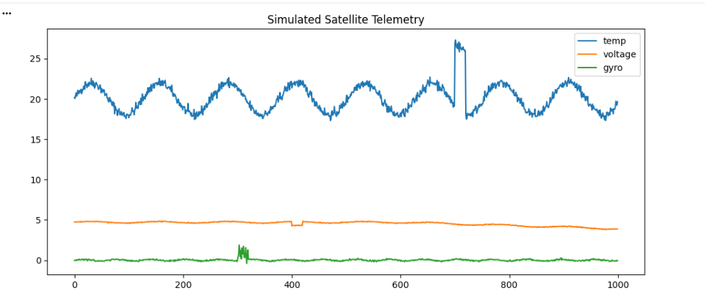
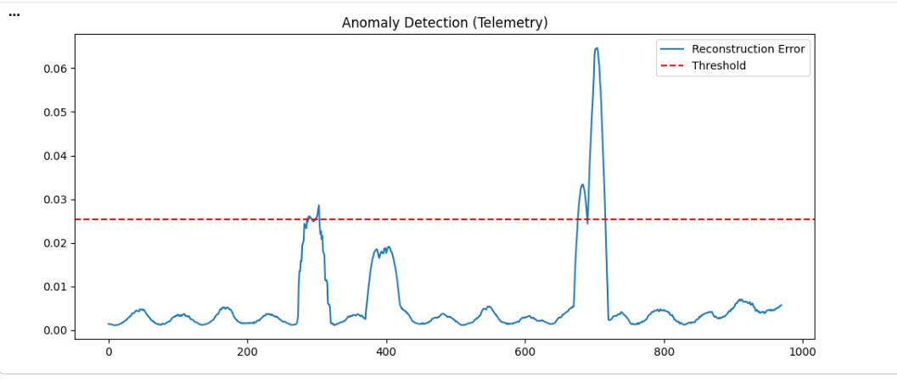
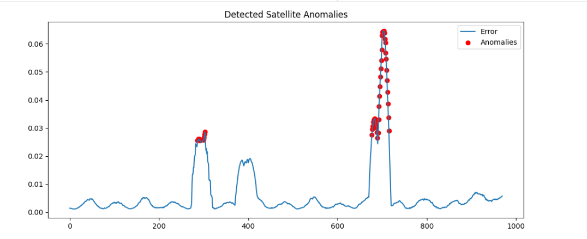
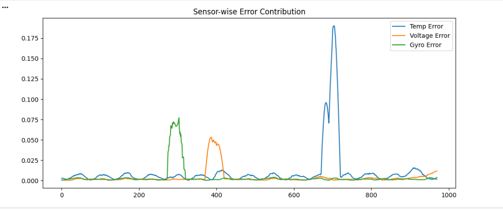
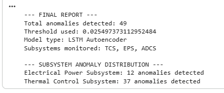

# 🚀 Satellite Telemetry Anomaly Detection using LSTM Autoencoder

##  Overview

This project presents an advanced anomaly detection system for satellite telemetry using a deep learning–based LSTM Autoencoder. The model is designed to learn normal operational patterns from multi-sensor telemetry data and identify deviations that indicate potential subsystem failures.

The system simulates real-world spacecraft telemetry signals, including temperature, voltage, and gyroscopic data, and detects anomalies corresponding to key satellite subsystems such as:

* Thermal Control Subsystem (TCS)
* Electrical Power Subsystem (EPS)
* Attitude Determination & Control System (ADCS)

This approach enables early fault detection, improving satellite reliability and mission safety.

---

##  Key Features

*  Simulation of realistic multi-sensor satellite telemetry
*  LSTM Autoencoder for unsupervised anomaly detection
*  Dynamic thresholding using percentile-based statistical methods
*  Sensor-wise error analysis for subsystem-level fault identification
*  Automated anomaly detection and alert generation
*  Satellite health score estimation over time
*  Ranking of critical anomalies based on severity

---

## 🏗️ Model Architecture

The anomaly detection system is built using a sequence-to-sequence LSTM Autoencoder:

* Encoder: LSTM layer compresses temporal patterns
* Bottleneck: Captures latent representation of normal behavior
* Decoder: Reconstructs original telemetry sequence
* Output: Reconstruction error used for anomaly detection

Loss Function: Mean Squared Error (MSE)
Optimizer: Adam

---

##  Methodology

1. **Data Simulation**
   Synthetic telemetry data is generated for temperature, voltage, and gyroscope sensors, including injected anomalies such as spikes, drops, drift, and noise.

2. **Preprocessing**
   Data is normalized using MinMax scaling and converted into time-series sequences.

3. **Model Training**
   The LSTM Autoencoder is trained to reconstruct normal telemetry behavior.

4. **Anomaly Detection**
   Reconstruction error is computed and smoothed.
   A dynamic threshold (95th percentile) is used to detect anomalies.

5. **Subsystem Diagnosis**
   Sensor-wise reconstruction error is analyzed to identify the affected subsystem (TCS, EPS, ADCS).

---

##  Results

* Accurate detection of injected anomalies
* Improved recall using adaptive thresholding
* Clear identification of subsystem-level faults
* Robust performance on time-series telemetry data

---

##  Visualizations

### Telemetry Simulation

### Reconstruction Error & Threshold

### Detected Anomalies

### Sensor-wise Error Contribution

### Final Output

---

##  Tech Stack

* Python
* NumPy, Pandas
* TensorFlow / Keras
* Scikit-learn
* Matplotlib

---

##  Applications

* Satellite health monitoring
* Predictive maintenance for spacecraft systems
* Fault detection in aerospace telemetry
* Time-series anomaly detection in engineering systems

---

##  Future Scope

* Integration of Transformer-based models for long-range temporal dependency learning
* Real-time anomaly detection on streaming telemetry data
* Deployment on edge systems for onboard satellite diagnostics
* Integration with real satellite datasets (e.g., ISRO/NASA missions)
* Advanced root-cause analysis using attention mechanisms

---

##  Author

**Revanth Reddy**
AI & Data Science Undergraduate
Specializing in Deep Learning, Computer Vision, and Applied AI Systems

---

##  Conclusion

This project demonstrates a robust and scalable approach to satellite telemetry monitoring using deep learning. By combining LSTM-based sequence modeling with system-level analysis, it provides a strong foundation for real-world aerospace applications.

---
